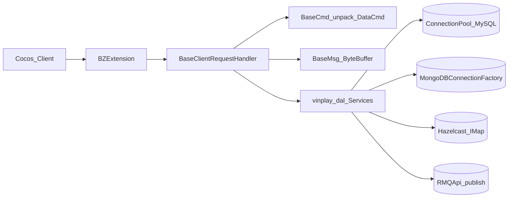

# WinClub — Kiến trúc hệ thống

Tài liệu định hướng cho Agent và dev: đọc kèm [`MEMORY.md`](./MEMORY.md) trước khi đổi cấu trúc lớn.

## 1. Tổng quan stack

| Lớp | Công nghệ | Thư mục / ghi chú |
|-----|-----------|-------------------|
| Game server | Java, BitZero Engine, Jetty | [`server/`](../server/), [`server/game/`](../server/game/) — nhiều module Gradle (JAR) |
| Portal / API | Java (VinPlay / vbee common) | [`server/VinPlayDAL`](../server/VinPlayDAL), thư viện `com.vinplay.*` |
| Client | Cocos Creator, TypeScript | [`client/`](../client/) — bundle qua `cc.assetManager.loadBundle` |
| Infra | Docker | [`docker/`](../docker/) — MySQL, MongoDB, Redis, RabbitMQ, Hazelcast |
| Live casino relay | Python, Playwright | (theo `.cursorrules`) — JSON vào pipeline, **không** scrape trực tiếp từ Java |

**Nguyên tắc:** tách xử lý (queue, cache), frontend module hóa; cấu hình nhạy cảm từ **`.env`**, không hardcode trong Compose/Java.

## 2. Hạ tầng runtime (Docker)

File Compose chính: [`docker/env-setup-docker-compose.yml`](../docker/env-setup-docker-compose.yml). Biến môi trường: [`docker/.env`](../docker/.env) (local, không commit) — mẫu: [`docker/.env.example`](../docker/.env.example).

| Service | Port (host) | Vai trò |
|---------|-------------|---------|
| MySQL 5.7 | 3306 | Dữ liệu quan hệ chính (user, giao dịch, game…) |
| MongoDB 4.x | 27017–27019 | Document (lobby, nap/rút, log tùy module) |
| Redis (Bitnami) | 6379 | Cache / session-style |
| RabbitMQ | 5672 (AMQP), 15672 (UI) | Hàng đợi async (ví dụ `queue_taixiu`) |
| Hazelcast 3.9 | 5701 | IMDG, map cache (ví dụ `cache_user_extra_info`) |

Network Compose: `mynetwork`, subnet `10.5.0.0/16`, IP tĩnh 10.5.0.2–6 cho từng service.

**Chạy (từ root repo):**

```bash
docker compose --env-file docker/.env -f docker/env-setup-docker-compose.yml config
docker compose --env-file docker/.env -f docker/env-setup-docker-compose.yml up -d
```

## 3. Luồng game server (BitZero)



### 3.1 Extension và routing

- Entry: class extends **`bitzero.server.extensions.BZExtension`** (ví dụ [`BaseGameExtension`](../server/game/Minigame/src/main/java/game/BaseGameExtension.java)).
- `init()` thường gọi: **`RMQApi.start`**, **`HazelcastLoader.start`**, **`MongoDBConnectionFactory.init`**, **`ConnectionPool.start`** (pool MySQL từ `config/db_pool.properties`).
- **`addRequestHandler(short moduleId, XxxModule.class)`** — client gửi theo **module id**; mỗi module là một **`BaseClientRequestHandler`**.

### 3.2 Packet: gửi / nhận

- **Gửi:** lớp trong `cmd/send/*Msg.java`, extends **`BaseMsg`** (hoặc `BaseMsgEx`), đóng gói **`ByteBuffer`** (`putStr`, `putLong`, …), `Id` kiểu `short`.
- **Nhận:** lớp trong `cmd/rev/*Cmd.java`, extends **`BaseCmd`**, `unpackData()` đọc buffer từ **`DataCmd`**.

Thư viện gốc: [`server/BitzeroAll/.../BaseMsg.java`](../server/BitzeroAll/src/main/java/bitzero/server/extensions/data/BaseMsg.java).

### 3.3 Xử lý lệnh trong module

- Override **`handleClientRequest(User user, DataCmd dataCmd)`**.
- **`switch (dataCmd.getId())`** — **sub-command id** (ví dụ subscribe/bet) → gọi handler, parse `*Cmd`, **`send(BaseMsg, user)`**.

Ví dụ tham chiếu: [`TaiXiuModule`](../server/game/taixiuMini/src/main/java/game/modules/minigame/TaiXiuModule.java).

### 3.4 Ghi dữ liệu

- **MySQL:** JDBC qua **`ConnectionPool`** + DAO (`*DAOImpl`, lobby `UserDAO`, …).
- **MongoDB:** **`MongoDBConnectionFactory.getDB()`** cho collection cụ thể.
- **Hazelcast:** `IMap` cho cache user/session/game.
- **RabbitMQ:** một số nghiệp vụ **chỉ publish** message; consumer có thể ở process/service khác — cần trace queue name trong `RMQApi` / config `rmq.properties` khi debug.

## 4. Cấu trúc `server/game/`

Nhiều project Gradle độc lập (Minigame, baucua, poker, slot, taixiu*, xocdia*, …). Mỗi game thường có:

- `config/db_pool.properties`, `mongo.properties`, `rmq.properties`, `hazelcast.properties`
- `src/.../cmd/send`, `cmd/rev`, `modules/*Module.java`

Build từng module hoặc theo root Gradle của `server` (xem [`SETUP.md`](../SETUP.md)).

## 5. Client (Cocos)

- Không load toàn bộ asset một lần; dùng **asset bundle**.
- UI phải xử lý **mất kết nối** (reconnect / trạng thái offline).

## 6. Hướng tái cấu trúc dài hạn (gợi ý)

- Gom phần init chung (RMQ, Hazelcast, Mongo, pool) vào **một bootstrap/core** giảm trùng lặp giữa các JAR.
- Chuẩn hóa bảng **module id / command id** (doc hoặc enum generated) để đồng bộ client–server.
- Theo dõi consumer RMQ và mapping queue → DB để tránh mất ghi khi worker down.
- Giảm phụ thuộc vào mã decompile (CFR); thay dần bằng source có kiểm thử.

## 7. Liên kết nhanh

- Quy tắc Agent: [`.cursorrules`](../.cursorrules)
- Bộ nhớ thay đổi: [`MEMORY.md`](./MEMORY.md)
- Compose + env: [`docker/`](../docker/)
- Deploy web (Nginx, domain, Cocos build): [`SETUP-WEB-PRODUCTION.md`](./SETUP-WEB-PRODUCTION.md)
- Snippet proxy game/API: [`nginx/snippets/winclub-game-routes.inc`](../nginx/snippets/winclub-game-routes.inc)
